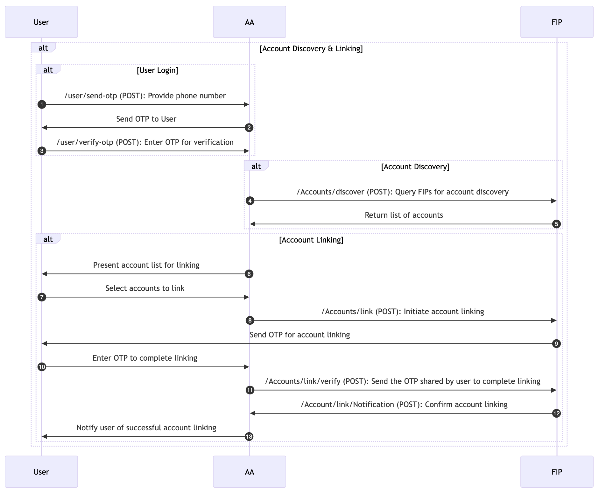

# Account Discovery & Linking

The Account Discovery & Linking process involves identifying the financial accounts a user holds across various institutions (FIPs) and linking them to the Account Aggregator for easy management and data access.

### **Steps Involved in Account Discovery & Linking:**

<figure><figcaption>
Account Discovery &#x26; Linking
</figcaption></figure>

#### **1. User Login and Identity Verification:**

The user logs into the AA application and provides their mobile number or other identity verification details. The AA then queries the FIPs to discover accounts associated with the user.

_**API (Internal API Spec):**_ _**/user/send-otp (POST)**_**:** The user login process after entering the phone number sends an OTP for login.

_**API (Internal API Spec):**_ _**/user/verify-otp (POST)**_**:** The user enters the OTP sent in the previous step to verify and login.

#### **2. Request to FIPs for Account Discovery:**

Upon receiving the request, each FIP searches its records for accounts associated with the provided identity (e.g., mobile number or email).

_**ReBIT API Involved (FIP 2.1.0 Spec):**_** /Accounts/discover (POST)**: The FIP returns details about the user's accounts to the AA.

#### **3. User Confirms Accounts to Link:**

Once the AA receives the list of accounts from various FIPs, it presents this information to the user. The user selects the accounts they wish to link with the AA. To authorize the linking, the user receives a One-Time Password (OTP).

_**ReBIT API Involved (AA 2.1.0 Spec):**_** /Accounts/link (POST)**: The AA sends a request to FIP to initiate linking of the account with the AA customer account.

_**ReBIT API Involved (AA 2.1.0 Spec):**_** /Accounts/link/verify (POST)**: The user needs to provide the OTP sent with the previous step to complete the account linking.

#### **4. Accounts Linked Successfully:**

After successful OTP verification, the user’s selected accounts are linked to the AA. The FIP will send a notfication to the AA on successful OTP verification for the account linking. These accounts can now be used for data sharing in future consent workflows.

_**ReBIT API Involved (AA 2.1.0 Spec):**_** /Account/link/Notification (POST)**: The AA confirms that the accounts have been successfully linked and communicates this to the user.

### Reference Implementation Guide & Using Simulator

For the above use case implementation, AA need to implement a few internal APIs for hanlding the user registration, login and accounts data along with the ReBIT API Specification.

In this scenario, the AA need to have a mock FIP to support the integration testing with mock response for the API requests to FIP. Below are the APIs from Simulator helpful for the implementation and integration.

* [Create a Mock FIP for Integration](../../technical-specifications/proxy-api-specs/integration-using-simulator/customisation-of-mock-entity-and-responses.md#entity-mock-register)
* [Composing Mock Response for](../../technical-specifications/proxy-api-specs/integration-using-simulator/customisation-of-mock-entity-and-responses.md#response-add)
  * Accounts Discovery
  * Accounts Linking
