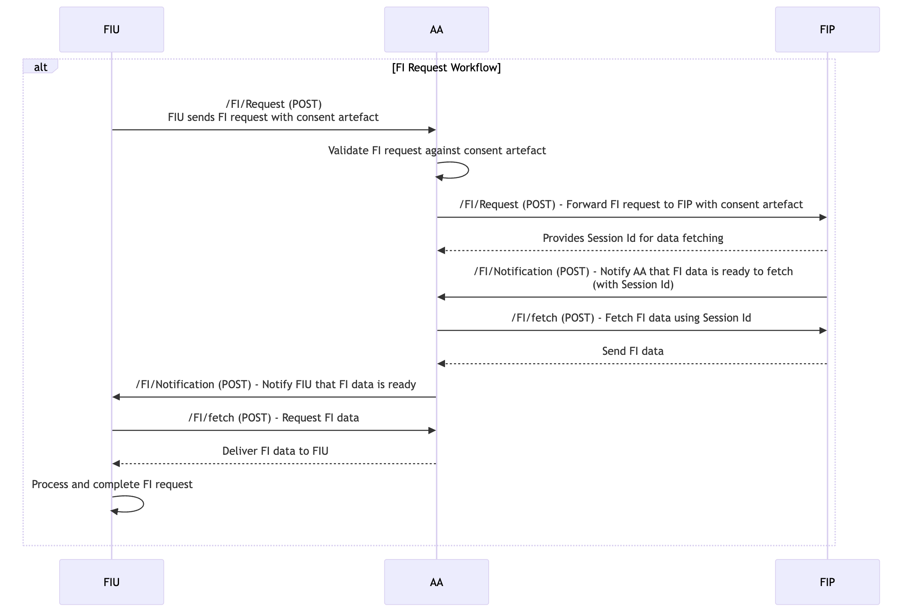

# FI Request Workflow

The Financial Information (FI) Request Workflow allows a Financial Information User (FIU) to request data from a Financial Information Provider (FIP) via the Account Aggregator (AA), based on user consent.

### **Steps Involved in FI Request Workflow:**

#### Pre-requisites:

The [Account Discovery & Linking](account-discovery-and-linking.md), [Consent Workflow](consent-workflow.md) are handled by the user to execute the FI request.

<figure><figcaption>
FI Request Workflow
</figcaption></figure>

#### **1. FIU Sends FI Request to AA:**

After the user’s consent is obtained, the FIU sends a Financial Information (FI) request to the AA to retrieve the data from the relevant FIPs. This request contains the details of the data required (such as bank account statements, loan details, etc.).

_**ReBIT API Involved (AA 2.1.0 Spec):**_** /FI/Request (POST)**: The FIU sends the FI request to the AA specifying the type of financial data required and the consent artefact.

#### **2. AA Forwards FI Request to FIP:**

The AA validates the request against the consent artefact and forwards it to the relevant FIP. The FIP retrieves the requested data from its system.

_**ReBIT API Involved (FIP 2.1.0 Spec):**_** /FI/Request (POST)**: The AA forwards the FI request to the FIP, including the consent artefact and data requirements.

#### **3. FIP Shares the Session Id with AA:**

Upon receiving the request and validating it against the consent artefact, the FIP provides a session Id to use as reference to fetch the data once it is ready.

#### **4. FIP sends a Notification to AA:**

FIP asyncronously compose the requested FI data and sends a notification to AA about the readiness to trigger the FI fetch request to get the data.

_**ReBIT API Involved (AA 2.1.0 Spec):**_** /FI/Notification (POST)**: The FIP sends a notification once the FI data composed and available to fetch.

#### **5. AA Fetches FI data from FIP & Sends a Notification to FIU:**

Once the AA receives the notification from the FIP, it fetches the financial information from the FIP. This data is provided in the agreed format and scope as per the consent.

Once the FI data is ready, AA sends a notification to FIU about the readiness of FI data to fetch by FIU from AA.

_**ReBIT API Involved (FIP 2.1.0 Spec):**_** /FI/fetch (POST)**: The AA sends a FI fetch request to FIP to receive the FI data for the specific Session Id.

_**ReBIT API Involved (FIU 2.0.0 Spec):**_** /FI/Notification (POST)**: The AA sends a notification once the FI data available to fetch.

#### **4. AA Delivers Data to FIU:**

Once the AA receives the data from the FIP, it delivers the financial information to the FIU. This data is provided in the agreed format and scope as per the consent.

_**ReBIT API Involved (AA 2.1.0 Spec):**_** /FI/fetch (POST)**: The AA delivers the financial information to the FIU based on the initial request.

#### **5. FI Request Completion:**

After the FIU receives the data, the FI request workflow is marked as complete. The FIU can now process the data in line with the consent provided by the user.
