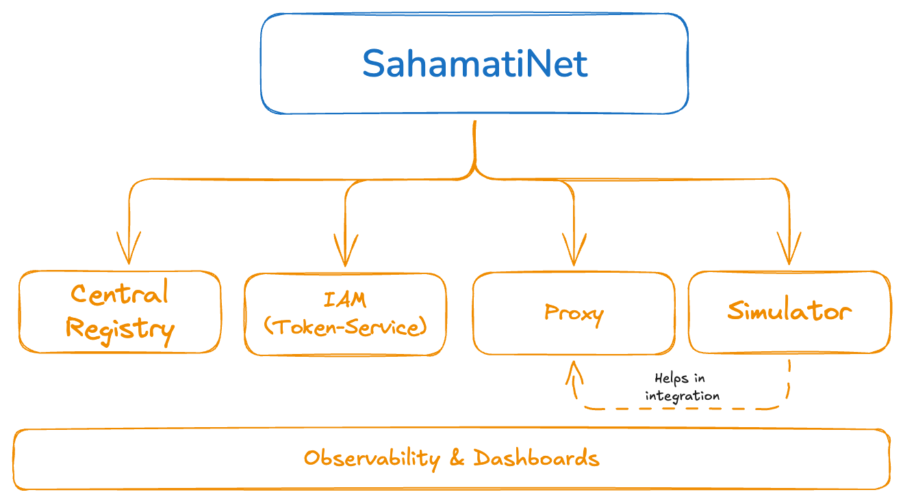

# SahamatiNet - Services

SahamatiNet offers a suite of services designed to facilitate smooth and efficient operations within the **Account Aggregator (AA) ecosystem**. These services play a critical role in enabling various members of the ecosystem—Account Aggregators (AAs), Financial Information Providers (FIPs), Financial Information Users (FIUs), and Technology Service Providers (TSPs)—to interact seamlessly, while adhering to data security, privacy, and interoperability standards.

Below are the key SahamatiNet services, each of which addresses a unique need within the ecosystem:

<figure><figcaption>
SahamatiNet - Services
</figcaption></figure>

### **1. Central Registry**

The Central Registry is a foundational service that serves as a directory for all registered ecosystem members. It exposes APIs that allow users to access detailed information about each member, including their roles (whether they are AAs, FIPs, FIUs, or TSPs) and other essential details like API endpoints and certificate for signature validation. This registry streamlines the process of discovering and connecting with other members in the ecosystem.

#### **Key Features:**

* Simplifies discovery of ecosystem members.
* Provides up-to-date information about registration, compliance, and API availability of members.
* Facilitates quick connections between AAs, FIPs, and FIUs for secure data exchange.

#### API Collection:


Central Registry - API Collection


### **2. Token-Service (IAM)**

In the AA ecosystem, secure and authorized communication between members is critical, especially given the sensitive nature of financial data. The Token-Service is responsible for generating access tokens that authenticate and authorize requests made between ecosystem members when using **ReBIT (Reserve Bank Information Technology) APIs**. These tokens ensure that all interactions between members, such as data requests or approvals, are securely authorized, maintaining data privacy and security.&#x20;

**Key Features:**

* Generates secure access tokens for authentication.
* Enables authorized requests between AAs, FIPs, FIUs, and other entities using ReBIT APIs.
* Ensures robust security for every transaction or data exchange.

#### API Collection:


Token-Service\[IAM] - API Collection


### **3. Proxy**

Interoperability is a core challenge in any data-sharing ecosystem. The Proxy acts as a bridge to ensure smooth and standardized communication between various ecosystem members using ReBIT APIs. When a request is made by one member to another (such as an FIU requesting data from an FIP), the Proxy  ensures that the API requests and responses are correctly routed and formatted. This service is crucial for ensuring that no matter what system or infrastructure a member uses, the interaction remains standardized and interoperable across the network.

**Key Features:**

* Facilitates interoperability between ecosystem members.
* Routes and standardizes API requests and responses.
* Simplifies cross-ecosystem communication by eliminating compatibility issues.

For more detailed insights into how the Proxy functions, you can refer to the below link:\
[Proxy Service Details](https://developer.sahamati.org.in/sahamatinet/proxy)

#### API Collection:



### **4. Simulator**

The Simulator service is designed to mimic the behavior of different ecosystem members during API integrations. This allows developers and teams to simulate various scenarios (such as being an AA, FIP, or FIU) and observe how the system responds, without needing to use live data or access actual financial institutions. The Simulator helps teams test their innovations, troubleshoot potential issues, and validate integrations in a controlled environment before moving to production.

**Key Features:**

* Allows teams to simulate interactions as different ecosystem members (e.g., AA, FIP, FIU).
* Facilitates scenario-based testing for ReBIT API integrations.
* Reduces the risk of errors during live operations by enabling pre-production testing.

To learn more about how to use the Simulator for API integration, visit the following link:\
[Simulator for API Integration](https://developer.sahamati.org.in/technical-specifications/proxy-api-specs/integration-using-simulator)

#### API Collection:


Simulator - API Collection


### **5. Observability**

The Observability service provides insights into the **AA network usage metrics**, helping ecosystem members understand their own performance and the overall health of the network. By monitoring key metrics such as transaction volumes, latency, and error rates, members can gain valuable data to improve their systems and ensure that they are adhering to the high standards of performance and reliability expected within the AA framework. Observability is essential for tracking system health, identifying potential issues, and optimizing performance over time.

**Key Features:**

* Monitors AA network usage metrics (e.g., transactions, errors).
* Provides actionable insights for performance improvement.
* Enhances transparency and operational visibility within the ecosystem.

To Access the Dashboard for the usage metrics, please use the below URL with your primiary contact email and password.

Observability Dashboard: [http://data.sandbox.sahamati.org.in/](http://data.sandbox.sahamati.org.in/)

***

#### Sandbox Environment file for Postman collection


SahamatiNet - Sandbox Environment


These SahamatiNet services together form a robust infrastructure that ensures secure, seamless, and efficient communication between different members of the AA ecosystem. By leveraging these services, participants in the Sahamati Buildaathon and other ecosystem members can focus on innovation, while SahamatiNet handles the complexities of interoperability, security, and monitoring.
