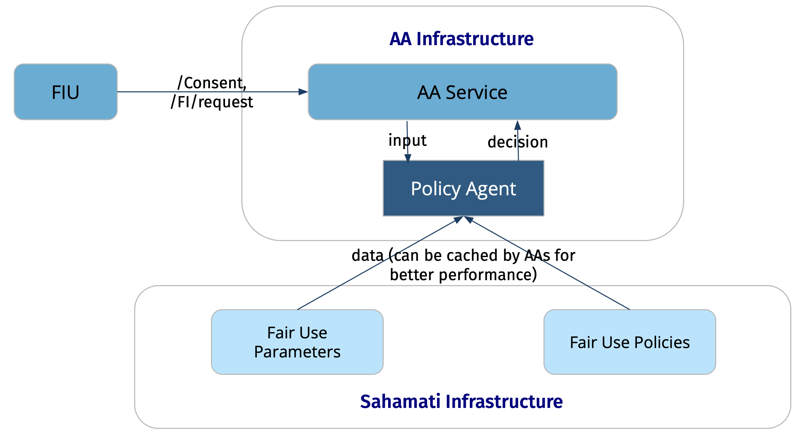

# Fair Use Compliance

### Fair Use Parameters

Fair Use Parameters establish guidelines for data collection practices within the AA ecosystem, ensuring transparency, fairness, and compliance. They define the bounds for attributes of consent artefact that can be employed for a specific use case. They are collaboratively defined by FIUs, AAs, the Fair Use Committee, and the Sahamati Governing Council.

Each use case is mapped to one Purpose Code and the AA ecosystem is collaborating with ReBIT to expand the list of purpose codes to ensure comprehensive coverage of various use cases at a granular level.

#### Fair Use Parameters Sample

```javascript
{
  "Purpose Code": "103: Aggregated statement",
  "Use Case": "Underwriting Risk: Underwriting a loan application",
  "License Types": "Bank, NBFC, HFC",
  "Fair Use Parameters": {
    "FITypes": ["All RBI", "SEBI and GSTN",  "FI Types"]
    "Consent Types": ["Profile", "Summary", "Transactions"]
    "FetchType": "Once"
    "Maximum Frequency": "One-time"
    "MaximumFIDataRange": "Consent expiry minus 14 months"
    "Maximum Consent Expiry": "1 month"
    "Maximum Data Expiry": "1 month"
    "Consent Mode": ["Store", "View"]
}
```

### FIUs & AAs are expected to align their usage of consents within the bounds of these parameters, ensuring consistency and adherence to established parameters.

### Role of AA Ecosystem Members

* **ReBIT**
  * Publish expanded list of purpose codes
* **Sahamati**
  * Fair Use Parameters APIs
  * Fair Use Policies
  * Provide Common Infrastructure
  * Fair Use Reporting to relevant parties
* **FIUs**
  * Adopt new purpose code definitions and fair use parameters
* **AAs**
  * Fair Use Policy enforcement for consent & FI requests
  * Report Fair Use data
* **FIPs**
  * No Changes required

### Fair Use Policy Framework

A policy-based automated framework that ensures compliance to fair use of consumer's consent and data in the AA ecosystem. AAs must enforce the Fair Use Policy for consent on all "Consent Request" and “FI Request” APIs.&#x20;

<figure><figcaption><p>AA Fair Use Policy Architecture</p></figcaption></figure>

The fair use policy framework consists of three main Policy components and a Policy Agent:

#### Policy Components

1. **Input**: The payload of the consent/FI request API
2. **Data**: Fair Use parameters and Fair use policies.
3. **Policy**: A set of rules applied to the consent/FI request API to ensure the fair use of consent and data. These rules primarily define the logic to evaluate the applicability of a given purpose code for the FIU by validating the consent parameters sent in the input against the parameters in the Fair Use parameters data. Policy rules should be defined as per a standard specification agreed and adopted by the Sahamati ecosystem.

#### Policy Agent

Policy Agent is responsible for evaluating the policy rules, as defined in the policy, against the API input using the data component of the policy. Output of the policy agent will be one of the output values defined in the policy rules. For example, the output of evaluating the fair use policy could be:

* **accept**: accept the incoming consent request and process it further (i.e. present to the consumer normally)
* **reject**: reject the incoming consent request and return an appropriate error to the FIU (e.g.: if the consent parameters are out of range by a large value)
* **report**: accept the request and report non-compliance

Sahamati will develop and release open-source policy agent SDKs for AAs to incorporate policy enforcement checks into their APIs. Alternatively, AAs have the option to develop their own policy agents following the specifications provided by Sahamati.
