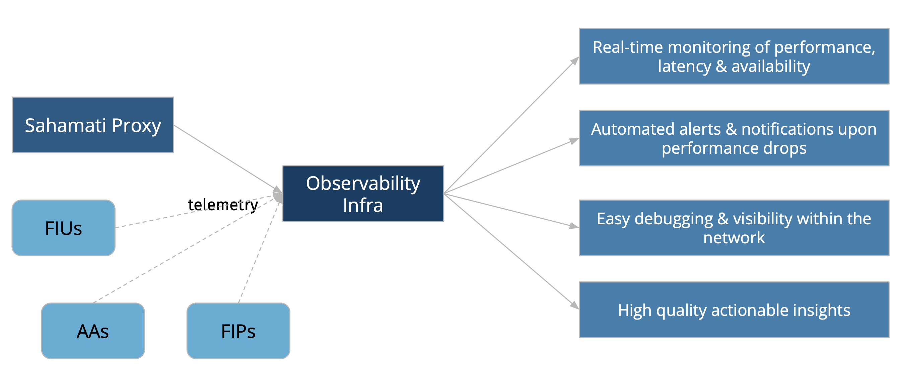

# Network Observability

Observability is a widely recognized practice within the realm of digital payments, enabling stakeholders such as payment processors, banks, merchants, and regulatory bodies to monitor transactions, detect anomalies, optimize performance, and ensure compliance. This practice has been instrumental in enabling the digital payments ecosystem to swiftly detect, manage, and resolve issues in real-time, contributing significantly to its growth and maturity.

In open & decentralized networks, critical factors that contribute to the success of networks include:

* **Adherence to Protocols:** for seamless integration among all members
* **High Success Rate:** for continuous growth of network, its members and consumers
* **Operational Efficiency:** for becoming scale efficient and drive population scale adoption
* **Policy Compliance:** for improving trust, and fostering fair & competent ecosystem

Network Observability is a structured approach to observe business, operational, & technical aspects of a network, and to discover actionable insights. Network observability provides a shared understanding among all members regarding the network's growth and health by identifying key metrics and establishing standard definitions. This fosters compliance with API protocols, facilitates the observation and improvement of operational efficiency, and encourages adherence to network policies.

**Network Observability plays a pivotal role in monitoring and achieving the key objectives of the network, thereby ensuring optimal Network Performance, Health & Growth**

<figure><figcaption>
Observability in AA context
</figcaption></figure>

## Network Observability in the AA context:

At this point in time, most data that is reported to Sahamati’s current network monitoring system (SAANS V2.0) is coming from AAs and includes:&#x20;

1. Daily MIS information about accounts linked, consents raised, consents fulfilled etc.&#x20;
2. FIP Technical Health information reported to SAANS

While both systems have been crucial for the ecosystem, they have notable shortcomings, such as:

1. They provide only 10-minute summaries rather than precise counts.
2. They offer only an indicative view of performance.
3. Data is reported only by the AAs for the AA<>FIP leg of transactions, offering only a partial transaction view.
4. Blind spots occur at the end of each day.
5. They do not address failures caused by scheduled downtimes and end-of-day processes.

These limitations underscore the importance of network observability, and Sahamati Network Observability aims to address these shortcomings, with the following as its primary objectives:

1. **A unified view of truth that all parties involved can agree with:** With the limitations in SAANS V2.0, where the system only captures 10-minute summaries of the FIP technical health, a significant dimension of the information gets dropped and hence starts to cause blind corners in the ecosystem.&#x20;
2. **A source of truth for automated support and dispute resolution:** Currently, the support system and dispute resolution rely heavily on bilateral sharing of transaction data for identification and resolution of transactions and failures, Sahamati Network Observability will allow for pinpointing of failure points and, in most scenarios, automated identification.&#x20;
3. **A mechanism for automated recon and billing:** With the pricing framework coming into the picture now, Sahamati Network Observability will enable automated reconciliation and billing for all members based on the data reported to telemetry
4. **Input into fraud engine:** As Sahamati is currently working on a fraud detection engine to protect customers, Sahamati Network Observability will play an integral role in its design and implementation.&#x20;
5. **Regulatory reporting:** Sahamati Network Observability will provide end-to-end visibility and allow entities to create regulatory reports and insights through the system itself for their reporting plus it will allow regulators to observe the performance and growth of the AA ecosystem.&#x20;
6. **Fair Use of AA:** Sahamati Network Observability will enable the detection and reporting of Fair Use violations and will allow for Sahamati as network facilitators to enable a smooth ecosystem.

<figure><figcaption>
Sahamati Network Observability
</figcaption></figure>

### What problems does it solve in the AA ecosystem?

Over the past year, the AA ecosystem has grown significantly, processing over 60 million consents. However, this growth has revealed several gaps and challenges:

1. **Multiple Versions of the Truth**: Different members have conflicting data, leading to inconsistencies.
2. **Poor Network Visibility**: Difficulties in reconciling data across the network due to limited visibility.
3. **Transparency Issues**: Lack of transparency for both internal and external stakeholders.
4. **Fragmented Datasets**: Data is scattered and hard to access.
5. **Long Debugging Cycles**: Extended time required for debugging and resolving issues.
6. **Regulatory Reporting Delays**: Slow data collection for regulatory compliance.
7. **Lack of Actionable Insights**: Insufficient generation of actionable insights.
8. **Poor Customer Experience**: Inadequate visibility leading to subpar customer experience.
9. **Hard-to-Trace Failures**: Failures are difficult to trace and often identified only after they occur.
10. **Decision-Making Transparency**: Lack of clarity in decision-making regarding technical retries.
11. **High Customer Drop-Off Rates**: Significant loss of customers due to these issues.

## Key design principles

It’s important that there is a strong foundation setup with the help of principles that allow only relevant information to flow transparently across members while protecting the rights of each member to maintain their unique business propositions and interests protected. Therefore, Sahamati Network Observability has been designed keeping in mind following design principles:

* Minimalism, simplicity and efficiency in design, emphasizing the importance of minimizing unnecessary complexity and features to achieve optimal performance and usability.
* Rather than imposing strict regulations or mandates, encourage voluntary participation and collaboration among members, fostering a sense of ownership and cooperation within the ecosystem.
* View the network as a collaborative effort involving all members, where each member contributes to the overall success and functionality of the network, promoting a sense of shared responsibility and mutual benefit.
* Sahamati, in this context, serves as a facilitator for establishing standardized protocols and frameworks within the network, providing guidelines and support to ensure interoperability and consistency across different components and members.
* Prioritize anonymity and the exclusion of sensitive information in the collection and analysis of business metrics, safeguarding privacy and confidentiality while still enabling effective monitoring and evaluation of network performance.
* Extend anonymity to technical metrics and logs at the individual member level, ensuring that network monitoring and troubleshooting activities do not compromise the privacy or security of members' data.
* Adopt open standards for data specification, promoting interoperability, accessibility, and collaboration among different stakeholders and systems.
