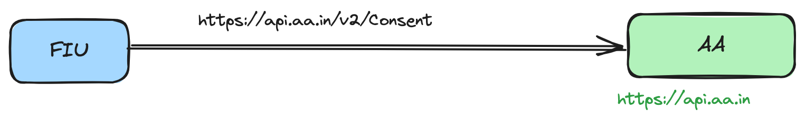

# Applications

## SahamatiNet Router

Interoperability is a core challenge in any data-sharing ecosystem. The Router acts as a bridge to ensure smooth and standardised communication between various ecosystem members using ReBIT APIs. When a request is made by one member to another (such as an FIU requesting data from an FIP), the Router  ensures that the API requests and responses are correctly routed and formatted. This service is crucial for ensuring that no matter what system or infrastructure a member uses, the interaction remains standardised and interoperable across the network.

**Key Features:**

* Facilitates interoperability between ecosystem members.
* Routes and standardises API requests and responses.
* Simplifies cross-ecosystem communication by eliminating compatibility issues.

### Current API reference 

The following diagram shows the current flow between FIU and AA flow for Consent API. With the current structure, the API requests are sent to the respective recipient member directly. This requires each member to understand the metadata of the recipient member and use their base path while sending.

<figure><figcaption>
Existing approach to use the APIs by AA Ecosystem in case of Consent API between FIU and AA
</figcaption></figure>

### Using Sahamati Router APIs 

Sahamati Router simplifies the process for members to send requests to any recipient by simply including the recipient identifier (**x-recipient-id**) in the header, under **x-request-meta**. The Router will then redirect the request to the corresponding recipient. This update must be implemented across all ReBIT APIs in the respective regulated entity's application.

<figure><figcaption>
Using Sahamati Router APIs for AA Ecosystem for Consent API between FIU and AA
</figcaption></figure>

Currently, the Router is fully implemented with all APIs compliant with ReBIT specifications v2.x.

## Central Registry (CR)

The Central Registry is a core service in the AA ecosystem, provided by Sahamati, which serves as a directory for all participants—Account Aggregators (AAs), Financial Information Providers (FIPs), and Financial Information Users (FIUs). It provides essential information about each participant, including their public IP addresses and public keys, enabling secure and interoperable communication within the ecosystem.

The Central Registry offers an API that allows participants to access details of other members, subject to role-based access restrictions. These roles are defined through identity tokens issued by Sahamati, ensuring that each participant can only access relevant information. For instance, AAs can fetch details of FIPs and FIUs, while FIPs and FIUs can retrieve information about AAs.

Additionally, the Central Registry is closely integrated with the Token Issuance service, which provides each participant with a short-lived JSON Web Token (JWT) for secure API calls across the ecosystem. This JWT is used to authenticate each participant and must be refreshed every 24 hours.

The Central Registry ensures seamless interaction within the AA ecosystem by making vital participant information easily accessible and securely managed.

## Identity Access Management (Token Service)

The Identity and Access Management (IAM) system within the AA ecosystem is responsible for ensuring secure and authorized access to ecosystem APIs. It manages participant roles, such as AA, FIP, or FIU, which are assigned during registration and embedded in the identity tokens issued by Sahamati. These roles govern access to services and ensure that participants can only access information they are authorized for.

To facilitate secure interactions, IAM utilizes Access Tokens—short-lived JSON Web Tokens (JWT)—to authenticate participants when they access ecosystem APIs. The Access Tokens, linked to the participant's role, ensure that only authorized individuals or entities can retrieve specific data or interact with services. Through role-based access control and token-based authentication, IAM safeguards the ecosystem's integrity and protects sensitive data while enabling secure communication among participants.
