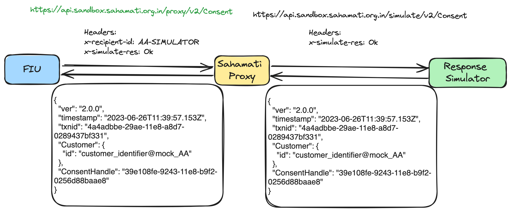
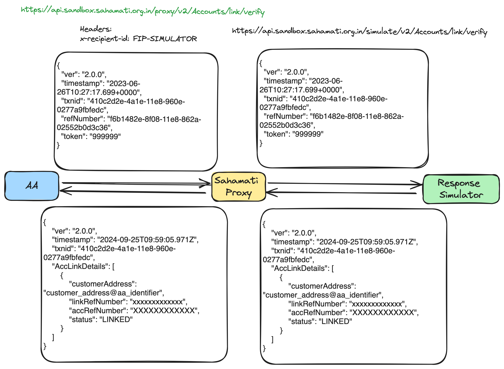
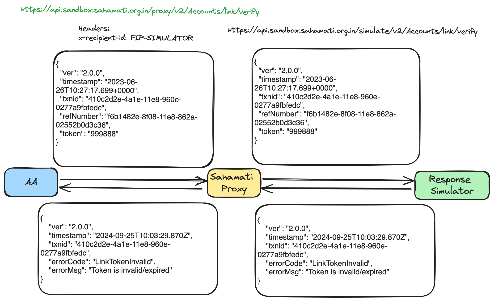
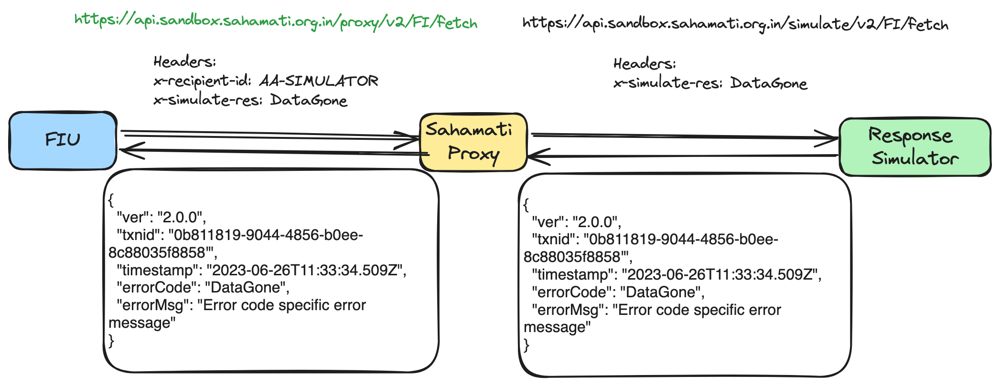

# Integration using Simulator

This page outlines the usage of **Response Simulator** by AA, FIU or FIP with entity APIs for the integration of Proxy. This **Response Simulator** will simulate the behaviour of the actual entity APIs to facilitate Sahamati proxy usage and testing.

## Overview:

The Response Simulator is designed to simulate the behaviour of real Entity’s Protocol APIs. It provides a controlled environment for developers to test and verify proxy service without relying on an actual entity.

The sample workflow diagram below illustrates the usage of the Response Simulator by including a simulated response with the expected response.

<figure><figcaption>
Entity Integration with Proxy using "Response Simulator"
</figcaption></figure>

The following two details are required in the request to use the APIs with Response Simulator:

* **recipient-id:** This is specified in the **x-request-meta** header through which the proxy that will route the request to the respective response simulator. The available options are,
  * **AA-SIMULATOR**
  * **FIU-SIMULATOR** and
  * **FIP-SIMULATOR**.
* **x-simulate-res:** This header should contain a hint for the expected response from the response simulator. It can be any of the options listed in the specific entity tables. If this is not included, the response simulator will default to returning a 200 OK response.

#### Sample Request Headers:

<pre class="language-javascript"><code class="lang-javascript">x-request-meta: [Base64 of {"recipient-id": "AA-SIMULATOR"}]
<strong>x-simulate-res: DataGone
</strong></code></pre>

## OTP Scenario:

The **FIP's Accounts/link/verify** API is the only one that utilizes the OTP received from the customer. This API is responsible for submitting the token/OTP back to the FIP to complete the account linkage process. The Response Simulator is set up to accept a predefined list of OTPs for successful account linkage. If an OTP outside of this list is used, the account linkage will fail. This is the default behavior of the Response Simulator, functioning without the need for the **x-simulate-res** header.

#### List of OTPs accepted by Response Simulator

<table data-header-hidden data-full-width="false"><thead><tr><th width="103"></th><th></th><th></th><th></th><th></th><th></th><th></th><th></th><th></th><th></th></tr></thead><tbody><tr><td>123456</td><td>654321</td><td>999999</td><td>223344</td><td>567890</td><td>456789</td><td>234567</td><td>345678</td><td>555444</td><td>222333</td></tr></tbody></table>

The sample workflow diagram below illustrates the usage of the valid OTP &#x20;

<figure><figcaption></figcaption></figure>

The sample workflow diagram below illustrates the usage of the invalid OTP&#x20;

<figure><figcaption></figcaption></figure>

## API Specifications:

### AA - Response Simulator:

This AA response simulator will support all the APIs listed under this ReBIT Spec - [https://api.rebit.org.in/viewSpec/AA\_2\_1\_0.yaml](https://api.rebit.org.in/viewSpec/AA\_2\_1\_0.yaml)

<table><thead><tr><th width="110">API</th><th width="262">Expected Response</th><th>x-simulate-res Header Options</th></tr></thead><tbody><tr><td>All</td><td>200 OK</td><td>Ok</td></tr><tr><td>All</td><td>400 Bad Request</td><td>BadRequest</td></tr><tr><td>All</td><td>401 Unauthorized Access</td><td>Unauthorized</td></tr><tr><td>All</td><td>404 Not Found</td><td>NotFound</td></tr><tr><td>All</td><td>409 Conflict</td><td>Conflict</td></tr><tr><td>All</td><td>412 Precondition failed</td><td>PreconditionFail</td></tr><tr><td>All</td><td>501 Not Implemented</td><td>NotImplemented</td></tr><tr><td>All</td><td>503 Service Unavailable</td><td>ServiceUnavailable</td></tr><tr><td>FI/fetch</td><td>
403 Forbidden

(DataFetchRequestInProgress)
</td><td>Forbidden</td></tr><tr><td>FI/fetch</td><td>410 Data Gone</td><td>DataGone</td></tr><tr><td>All</td><td>
Timeout Scenario

(delay in sending response)
</td><td>TimeOut</td></tr></tbody></table>

Sample FI/fetch workflow using AA-SIMULATOR:

<figure><figcaption></figcaption></figure>

### FIU Response Simulator

This FIU response simulator will support all the APIs listed under this ReBIT Spec - [https://api.rebit.org.in/viewSpec/FIU\_2\_0\_0.yaml](https://api.rebit.org.in/viewSpec/FIU\_2\_0\_0.yaml)

<table><thead><tr><th width="145">API</th><th width="176">Expected Response</th><th width="354">x-simulate-res Header Options</th></tr></thead><tbody><tr><td>All</td><td>200 OK</td><td>Ok</td></tr><tr><td>All</td><td>400 Bad Request</td><td>BadRequest</td></tr><tr><td>All</td><td>401 Unauthorized Access</td><td>Unauthorized</td></tr><tr><td>All</td><td>404 Not Found</td><td>NotFound</td></tr><tr><td>All</td><td>409 Conflict</td><td>Conflict</td></tr><tr><td>All</td><td>412 Precondition failed</td><td>PreconditionFail</td></tr><tr><td>All</td><td>501 Not Implemented</td><td>NotImplemented</td></tr><tr><td>All</td><td>503 Service Unavailable</td><td>ServiceUnavailable</td></tr><tr><td>All</td><td>
Timeout Scenario

(delay in sending response)
</td><td>TimeOut</td></tr></tbody></table>

### FIP Response Simulator:

This FIP response simulator will support all the APIs listed under this ReBIT Spec - [https://api.rebit.org.in/viewSpec/FIP\_2\_1\_0.yaml](https://api.rebit.org.in/viewSpec/FIP\_2\_1\_0.yaml)

<table><thead><tr><th>API</th><th>Expected Response</th><th width="340">x-simulate-res Header Options</th></tr></thead><tbody><tr><td>All</td><td>200 OK</td><td>Ok</td></tr><tr><td>All</td><td>400 Bad Request</td><td>BadRequest</td></tr><tr><td>All</td><td>401 Unauthorized Access</td><td>Unauthorized</td></tr><tr><td>All</td><td>404 Not Found</td><td>NotFound</td></tr><tr><td>All</td><td>409 Conflict</td><td>Conflict</td></tr><tr><td>All</td><td>412 Precondition failed</td><td>PreconditionFail</td></tr><tr><td>All</td><td>501 Not Implemented</td><td>NotImplemented</td></tr><tr><td>All</td><td>503 Service Unavailable</td><td>ServiceUnavailable</td></tr><tr><td>FI/fetch</td><td>
403 Forbidden

(DataFetchRequestInProgress)
</td><td>Forbidden</td></tr><tr><td>All</td><td>
Timeout Scenario

(delay in sending response)
</td><td>TimeOut</td></tr></tbody></table>

