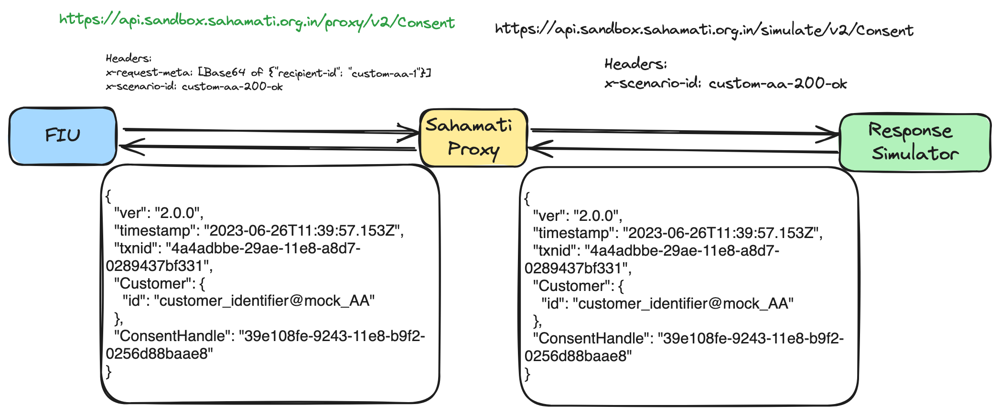
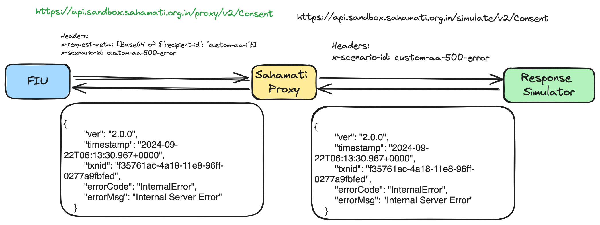

# Custom Responses Usage

This page explains the integration of custom entities and custom responses configured with proxy APIs.

## Overview:

Using mock entities, developers can simulate the behavior of real entities within a controlled environment. Likewise, mock responses enable developers to define and manipulate the expected outcomes of API calls, replicating various scenarios that may arise in the workflow.

The sample workflow diagrams below illustrates the usage of the Mock Entities and Responses by including entity id and scenario id under headers.

<figure><figcaption>
Sample workflow of mocking success scenario
</figcaption></figure>

<figure><figcaption>
Sample workflow of mocking error scenario
</figcaption></figure>

The following two details are required in the request to use the APIs with custom entity and respective configured response:

* **x-request-meta:** This header specifies the proxy that will route the request to the respective custom entity created using [Create API](customisation-of-mock-entity-and-responses.md#entity-mock-register).
* **x-scenario-id:** This header should contain the scenario id for the specific response configured for respective entity using [Add response API](customisation-of-mock-entity-and-responses.md#response-add)

#### Sample Request Headers:

<pre class="language-javascript"><code class="lang-javascript">x-request-meta: [Base64 of {"recipient-id": "&#x3C;custom-aa-id>"}]
<strong>x-scenario-id: custom-aa-id-500-error
</strong></code></pre>
