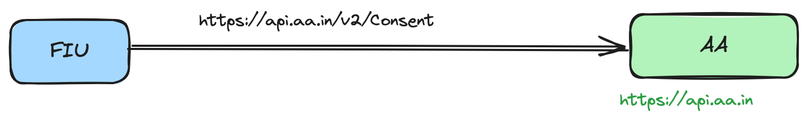

# APIs Integration

## Current API reference 

With the current structure, the API requests are sent to the respective recipient member directly. This requires each member to understand the metadata of the recipient member and use their base path while sending.

<figure><figcaption>
Existing approach to use the APIs by AA Ecosystem
</figcaption></figure>

## Using Sahamati Router APIs 

Sahamati Router makes it easy for the members to send the request to any recipient just by adding the **recipient identifier** in the header under **x-recipient-id**.

<figure><figcaption>
Using Sahamati Router APIs for AA Ecosystem
</figcaption></figure>

<table><thead><tr><th width="157">Particulars</th><th width="176">Comments</th><th></th></tr></thead><tbody><tr><td>Host</td><td>The base path to use by the members of Sahamati Router.</td><td><a href="https://api.sandbox.sahamati.org.in/proxy">​https://api.sandbox.sahamati.org.in/proxy</a></td></tr><tr><td>Headers</td><td>This will remain same as previous.</td><td>
​
<ul><li>x-jws-signature - Authorization</li><li>Token (from sender)</li></ul></td></tr><tr><td>Additional Headers</td><td>The recipient id is a required property. It is the identifier of the receiver to whom the API call needs to be forwarded.</td><td>x-request-meta</td></tr></tbody></table>
